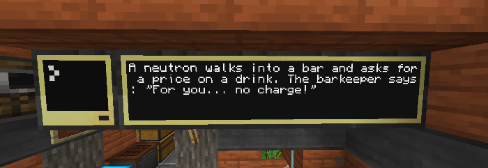

<div align="center" style="text-align: center">

# JokeAPI_ComputerCraft
## A ComputerCraft program that displays a joke from [JokeAPI](https://github.com/Sv443/JokeAPI) on an in-game monitor on interval

<br>



</div>

<br><br>

## Installation:
1. Craft a computer and around 4-12 monitors
2. Place the monitors next to each other and make sure one of them touches the computer
3. Run the following commands in the computer:
```
label set jokeapi
pastebin get 6tnmW93j startup
edit startup.lua
```
4. Change the `MONITOR_SIDE` variable at the top to the side where your computer touches the monitors
    - Valid side values are: `"front"`, `"back"`, `"left"`, `"right"`, `"top"` or `"bottom"`
    - The other variables can of course also be changed, like the interval at which a new joke is fetched or the text size
5. Press `Ctrl`, navigate to `Save` and press `Enter` to save your changes
6. Press `Ctrl`, navigate to `Exit` and press `Enter` to exit the editor
7. Run the command `reboot`

After these steps, the computer will enter an infinite loop. To exit it, hold down `Ctrl` and `T`.  
To edit the program, go to step 4 again.

<br><br>

### License:
This code is licensed under the [MIT license](https://sv443.net/LICENSE)
